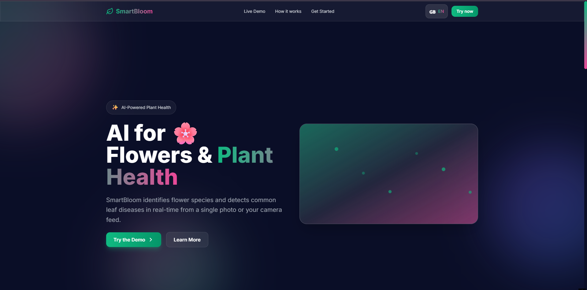

# SmartBloom

**Repository:** [github.com/noorsamer1/SmartBloom](https://github.com/noorsamer1/SmartBloom)

SmartBloom is an intelligent computer vision system that helps users identify plant species and detect leaf diseases in real time. The platform combines YOLO object detection and CNN-based flower classification to support both flower recognition and disease localization, with a FastAPI backend and React frontend for live demos and uploads.



### Assistant in action

After the YOLO model detects a plant disease, the assistant plays a short animation, then **streams the plant disease diagnosis and step-by-step recommendations** to fix it.

*To add the demo video: on GitHub, click **Edit this file** on this README, then drag and drop your `Recording 2026-02-03 184759.mp4` into the editor. GitHub will upload it and insert a playable video link here.*

## Features

- **Flower classification** — EfficientNet-B0 classifier over 102 Oxford Flowers classes.
- **Plant disease detection** — YOLO-based detector (YOLOv8 / YOLO11, etc.) for leaf diseases via Ultralytics.
- **FastAPI backend** — `POST /predict_flower` and `POST /predict_disease` for image inference.
- **React frontend** — Landing page, live demo, and webcam/upload UI (Vite + Tailwind).

## Tech stack

- **Backend:** Python, PyTorch, torchvision, Ultralytics, FastAPI, Hydra.
- **Frontend:** React 19, Vite, Tailwind CSS, Framer Motion, react-webcam.
- **Training:** Config-driven with Hydra; configs live in `configs/` (`flower.yaml`, `disease.yaml`).

## Repository structure

| Path | Description |
|------|-------------|
| `web_backend.py` | FastAPI app; run from repo root. |
| `src/` | Training scripts (`train_flower_classifier.py`, `train_disease_detector.py`, `prepare_oxford_flowers.py`) and inference helpers. |
| `configs/` | Hydra configs for flower and disease training. |
| `smartbloom-react/` | React frontend — `npm install` and `npm run dev`. |
| `data/` | **Not in repo** (gitignored). See [Datasets](#datasets-not-in-repo) for expected layout and sources. |

## Prerequisites

- **Python 3.10+** (PyTorch; CUDA optional for GPU training).
- **Node.js** for the frontend.

## Installation

**Backend**

```bash
pip install -r requirements.txt
```

Install PyTorch separately if needed (see comments in `requirements.txt`; e.g. CUDA build).

**Frontend**

```bash
cd smartbloom-react && npm install
```

## Datasets (not in repo)

Datasets are **not** included in this repo because of their size. You must obtain and place them locally.

- **Flower classification (Oxford Flowers 102)**  
  Expected layout: `data/flower_classification/` with `train/`, `val/`, `test/` and `class_index.json`.  
  After downloading (e.g. Kaggle or official source), use `src/prepare_oxford_flowers.py` to build splits and class index.  
  Do **not** commit `data/flower_classification/` or any images.

- **Disease detection (YOLO format)**  
  Dataset under `data/plant_disease_detection/` with a `data.yaml` that points to `train`/`val` (and optionally `test`) image directories.  
  See `data/README.md` and `data/plant_disease_detection/data.yaml.example` for structure.  
  Do **not** commit images or label files.

## Model weights

The backend loads:

- Flower classifier: `artifacts/flower_classifier/<run_id>/best_model.pth`
- Disease detector: `artifacts/disease_detector/<run_id>_<model>/weights/best.pt`

If you clone without these artifacts, either train locally (see [Training](#training)) or place your own weights in the same paths and adjust `web_backend.py` if your run IDs differ.

## Running

**Backend** (from project root)

```bash
python -m uvicorn web_backend:app --reload
```

**Frontend**

```bash
cd smartbloom-react && npm run dev
```

Then open the frontend URL (e.g. `http://localhost:5173`) and use the demo against the backend.

## Training

Run from the **project root** so paths in configs resolve correctly.

**Flower classifier**

```bash
python src/train_flower_classifier.py
```

Uses `configs/flower.yaml` and `data_dir: data/flower_classification`. Requires the Oxford Flowers data prepared as above.

**Disease detector**

```bash
python src/train_disease_detector.py
```

Uses `configs/disease.yaml` and `data/plant_disease_detection/data.yaml`. Requires a YOLO-format dataset in place.

**Cloud training** — You can use the Colab notebook `SmartBloom_Disease_Training_Fixed.ipynb` for GPU training and exporting weights (e.g. to Google Drive).

## License

MIT. Contributions welcome (PRs, issues).
